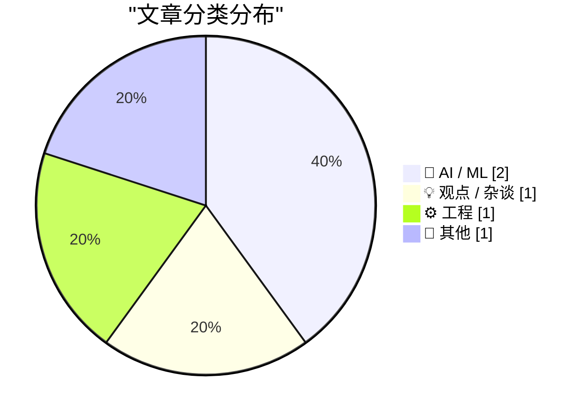
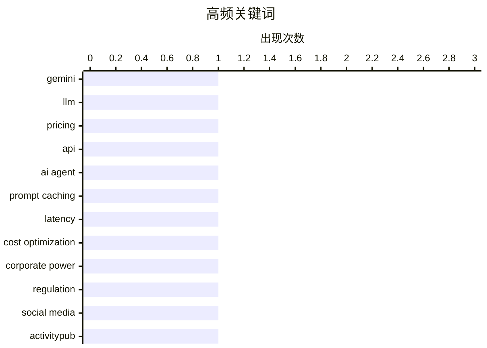

# 📰 AI 博客每日精选 — 2026-02-20

> 来自 Karpathy 推荐的 92 个顶级技术博客，AI 精选 Top 5

## 📝 今日看点

今日技术圈焦点集中于AI模型的商业化竞争与架构创新，大模型定价策略成为关键战场。同时，去中心化协议与联邦式网络架构持续展现其长期生命力。此外，关于科技公司权力边界与社会责任的深度讨论也再次进入公众视野。

---

## 🏆 今日必读

🥇 **Gemini 3.1 Pro**

[Gemini 3.1 Pro](https://simonwillison.net/2026/Feb/19/gemini-31-pro/#atom-everything) — simonwillison.net · 21 小时前 · 🤖 AI / ML

> 谷歌发布了Gemini 3.1系列的首个模型Gemini 3.1 Pro，其定价与Gemini 3 Pro相同。输入和输出（低于20万tokens）的每百万tokens价格分别为2美元和12美元，在20万至100万tokens区间则为4美元和18美元。该模型的基准测试成绩与Claude Opus 4.6非常接近，但价格不到后者的一半。文章还提及了其在SVG动画生成方面相比Gemini 3 Pro有所改进。

💡 **为什么值得读**: 对于关注大模型性价比和最新技术动态的开发者而言，本文提供了Gemini 3.1 Pro关键的价格、性能对比和核心改进信息，是评估模型选型的重要参考。

🏷️ Gemini, LLM, Pricing, API

🥈 **引用Thariq Shihipar的观点**

[Quoting Thariq Shihipar](https://simonwillison.net/2026/Feb/20/thariq-shihipar/#atom-everything) — simonwillison.net · 8 小时前 · 🤖 AI / ML

> 引用了Thariq Shihipar关于提示词缓存（prompt caching）在长周期智能体产品中关键作用的观点。在Claude Code这类产品中，整个系统架构都围绕提示词缓存构建，通过复用先前轮次的计算来显著降低延迟和成本。高缓存命中率不仅能降低成本，还能支持更宽松的订阅计划速率限制，因此团队会对其缓存命中率设置监控告警。

💡 **为什么值得读**: 这篇文章揭示了大模型应用在工程化落地中一个核心的成本与性能优化策略，对构建生产级AI应用的工程师具有直接的实践指导价值。

🏷️ AI Agent, Prompt Caching, Latency, Cost Optimization

🥉 ** Pluralistic：被刺穿的公司面纱（2026年2月20日）**

[Pluralistic: A perforated corporate veil (20 Feb 2026)](https://pluralistic.net/2026/02/20/karioca-konzernrecht/) — pluralistic.net · 53 分钟前 · 💡 观点 / 杂谈

> 文章核心主题是探讨限制公司权力的巴西方法，即“刺穿公司面纱”。今日链接板块涵盖了多个社会与技术议题，包括社交媒体如何将美国政党变成第三方组织的宿主、“公民”成为雇佣演员、保险外骨骼、与斯诺登和吉布森的对话等。作者还预告和回顾了自己的公开活动，并介绍了其著作出版情况。

💡 **为什么值得读**: 本文以独特的“链接汇编”形式，提供了关于公司治理、社会媒体政治生态等多个前沿批判性思考的入口，信息密度高且视角多元。

🏷️ Corporate Power, Regulation, Social Media

---

## 📊 数据概览

| 扫描源 | 抓取文章 | 时间范围 | 精选 |
|:---:|:---:|:---:|:---:|
| 89/92 | 2503 篇 → 8 篇 | 24h | **5 篇** |

### 分类分布



### 高频关键词



<details>
<summary>📈 纯文本关键词图（终端友好）</summary>

```
gemini            │ ████████████████████ 1
llm               │ ████████████████████ 1
pricing           │ ████████████████████ 1
api               │ ████████████████████ 1
ai agent          │ ████████████████████ 1
prompt caching    │ ████████████████████ 1
latency           │ ████████████████████ 1
cost optimization │ ████████████████████ 1
corporate power   │ ████████████████████ 1
regulation        │ ████████████████████ 1
```

</details>

### 🏷️ 话题标签

**gemini**(1) · **llm**(1) · **pricing**(1) · api(1) · ai agent(1) · prompt caching(1) · latency(1) · cost optimization(1) · corporate power(1) · regulation(1) · social media(1) · activitypub(1) · federated protocol(1) · decentralization(1) · personal(1) · medical leave(1) · update(1)

---

## 🤖 AI / ML

### 1. Gemini 3.1 Pro

[Gemini 3.1 Pro](https://simonwillison.net/2026/Feb/19/gemini-31-pro/#atom-everything) — **simonwillison.net** · 21 小时前 · ⭐ 26/30

> 谷歌发布了Gemini 3.1系列的首个模型Gemini 3.1 Pro，其定价与Gemini 3 Pro相同。输入和输出（低于20万tokens）的每百万tokens价格分别为2美元和12美元，在20万至100万tokens区间则为4美元和18美元。该模型的基准测试成绩与Claude Opus 4.6非常接近，但价格不到后者的一半。文章还提及了其在SVG动画生成方面相比Gemini 3 Pro有所改进。

🏷️ Gemini, LLM, Pricing, API

---

### 2. 引用Thariq Shihipar的观点

[Quoting Thariq Shihipar](https://simonwillison.net/2026/Feb/20/thariq-shihipar/#atom-everything) — **simonwillison.net** · 8 小时前 · ⭐ 24/30

> 引用了Thariq Shihipar关于提示词缓存（prompt caching）在长周期智能体产品中关键作用的观点。在Claude Code这类产品中，整个系统架构都围绕提示词缓存构建，通过复用先前轮次的计算来显著降低延迟和成本。高缓存命中率不仅能降低成本，还能支持更宽松的订阅计划速率限制，因此团队会对其缓存命中率设置监控告警。

🏷️ AI Agent, Prompt Caching, Latency, Cost Optimization

---

## 💡 观点 / 杂谈

### 3.  Pluralistic：被刺穿的公司面纱（2026年2月20日）

[Pluralistic: A perforated corporate veil (20 Feb 2026)](https://pluralistic.net/2026/02/20/karioca-konzernrecht/) — **pluralistic.net** · 53 分钟前 · ⭐ 19/30

> 文章核心主题是探讨限制公司权力的巴西方法，即“刺穿公司面纱”。今日链接板块涵盖了多个社会与技术议题，包括社交媒体如何将美国政党变成第三方组织的宿主、“公民”成为雇佣演员、保险外骨骼、与斯诺登和吉布森的对话等。作者还预告和回顾了自己的公开活动，并介绍了其著作出版情况。

🏷️ Corporate Power, Regulation, Social Media

---

## ⚙️ 工程

### 4. ActivityPub

[ActivityPub](https://nesbitt.io/2026/02/20/activitypub.html) — **nesbitt.io** · 15 小时前 · ⭐ 19/30

> ActivityPub是一个用于发布公共活动的联邦式协议。该协议最初于1714年标准化，目前仍在超过46,000个活跃实例中使用。

🏷️ ActivityPub, Federated Protocol, Decentralization

---

## 📝 其他

### 5. 生活近况：因病休假

[Life Update: On medical leave](https://xeiaso.net/notes/2026/life-update-medical-leave/) — **xeiaso.net** · 15 小时前 · ⭐ 16/30

> 作者因健康原因需要休假，此次休假将持续到四月初。

🏷️ Personal, Medical Leave, Update

---

*生成于 2026-02-20 15:47 | 扫描 89 源 → 获取 2503 篇 → 精选 5 篇*
*基于 [Hacker News Popularity Contest 2025](https://refactoringenglish.com/tools/hn-popularity/) RSS 源列表，由 [Andrej Karpathy](https://x.com/karpathy) 推荐*
*由「懂点儿AI」制作，欢迎关注同名微信公众号获取更多 AI 实用技巧 💡*
